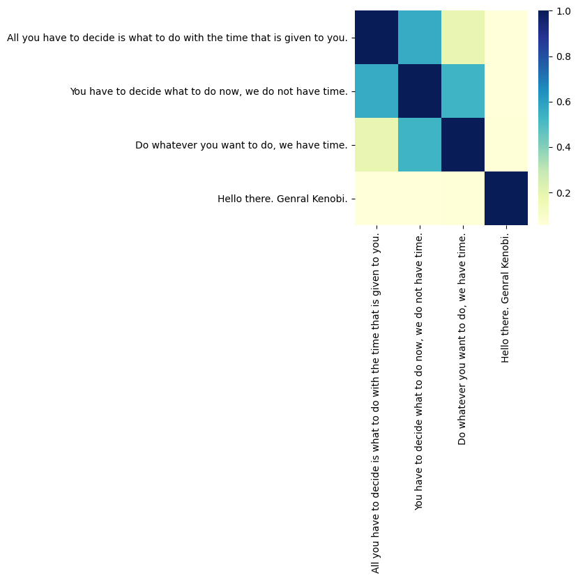
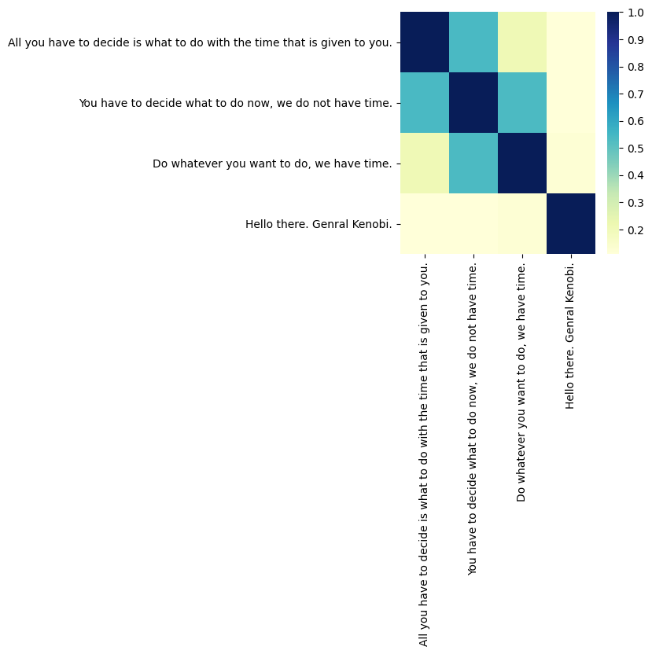

# Strimilarity

Python package for calculating the similarity between a pair or multiple sentences. This package uses vectorization and tokenization, along cosine similarity to calculate the similarity. It allows the use of functions for comparing only the lexical or semantic similarity, or the use of a function calculating a wighted avarage of both types of similarities.

## Installation

Dependencies

* nltk
* sklearn
* tensorflow
* tensorflow_hub

Installation

```
pip install strimilarity
```

## Usage

### Initialize

```python
import strimilarity
starty = strimilarity.Strimilarity()
```

#### Languages

Strimilarity uses nltk for finding out the stopwords to remove from the sentences to compare. This allows the lexical similarity to be calculated without any words that may increase the similarity between sentences even when they don't contribute much to the actual meaning of the sentence.

Right now, Strimilarity by default uses English stopwords, but it can be initialized in Spanish as well.

Using spanish stopwords:

```python
starty = strimilarity.Strimilarity('es')
```

### Get similarity between a pair of sentences

If you want to get the similarity of just two sentences Strimilarity has three different functions:

* similarity_pair
* lexical_similarity_pair
* semantic_similarity_pair

#### Similarity Pair

This function returns the weighted avarage of the lexical and semantic similarity between two sentences.

Get similarity:

```python
sentence1 = 'All you have to decide is what to do with the time that is given to you.'
sentence2 = 'You have to decide what to do now, we do not have time.'

starty = strimilarity.Strimilarity()

similarity = starty.similarity_pair(sentence1, sentence2)

print(similarity)
```

Result:

```
0.5634442369896036
```

This function also has the w_lexical and w_semantic optional parameters. This represent the weight for the lexical similarity and the weight of the semantic similarity, used in calculating the weighted avarage to get to a final similarity score.

#### Lexical Similarity Pair

This function returns the lexical similarity between two sentences. In simple terms it represent in a percentage the amount of wrods in common between the two sentences.

Get similarity:

```python
sentence1 = 'All you have to decide is what to do with the time that is given to you.'
sentence2 = 'You have to decide what to do now, we do not have time.'

starty = strimilarity.Strimilarity()

similarity = starty.lexical_similarity_pair(sentence1, sentence2)

print(similarity)

```

Result:

```
0.5892556509887895
```

#### Semantic Similarity Pair

This function returns the semantic similarity between two sentences. In simple terms it represent in a percentage the how similar two sentences are in meaning.

Get similarity

```python
sentence1 = 'All you have to decide is what to do with the time that is given to you.'
sentence2 = 'You have to decide what to do now, we do not have time.'

starty = strimilarity.Strimilarity()

similarity = starty.semantic_similarity_pair(sentence1, sentence2)

print(similarity)
```

Result:

```
0.5376328
```

### Get similarity between multiple sentences

If you want to get a matrix of similarities between multiple sentences Strimilarity has three different functions:

* similarity
* lexical_similarity
* semantical_similarity

#### Similarity

This function returns a matrix with the weighted avarages of the lexical and semantic similarities between sentences.

Get similarity:

```python
sentences = [
    'All you have to decide is what to do with the time that is given to you.',
    'You have to decide what to do now, we do not have time.',
    'Do whatever you want to do, we have time.',
    'Hello there. Genral Kenobi.'
]

starty = strimilarity.Strimilarity()

similarity = starty.similarity(sentences)

print(similarity)
```

Result:

```
[[1.00000012 0.56344418 0.18751006 0.05443659]
 [0.56344418 1.00000006 0.533435   0.05470197]
 [0.18751006 0.533435   1.00000006 0.06253323]
 [0.05443659 0.05470197 0.06253323 1.00000012]]
```

Result using seaborn to plot data:



#### Lexical Similarity

This function returns a matrix with the lexical similarities between multiple sentences. 

Get similarity:

```python
sentences = [
    'All you have to decide is what to do with the time that is given to you.',
    'You have to decide what to do now, we do not have time.',
    'Do whatever you want to do, we have time.',
    'Hello there. Genral Kenobi.'
]

starty = strimilarity.Strimilarity()

similarity = starty.lexical_similarity(sentences)

print(similarity)
```

Result:

```
[[1.         0.58925565 0.16666667 0.        ]
 [0.58925565 1.         0.53033009 0.        ]
 [0.16666667 0.53033009 1.         0.        ]
 [0.         0.         0.         1.        ]]
```

Result using seaborn to plot data:


#### Semantic Similarity

This function returns a matrix with the semantic similarities between multiple sentences.

Get similarity:

```python
sentences = [
    'All you have to decide is what to do with the time that is given to you.',
    'You have to decide what to do now, we do not have time.',
    'Do whatever you want to do, we have time.',
    'Hello there. Genral Kenobi.'
]

starty = strimilarity.Strimilarity()

similarity = starty.semantic_similarity(sentences)

print(similarity)
```

Result:

```
[[1.0000002  0.5376327  0.20835346 0.10887319]
 [0.5376327  1.0000001  0.5365399  0.10940395]
 [0.20835346 0.5365399  1.0000001  0.12506646]
 [0.10887319 0.10940395 0.12506646 1.0000002 ]]
```

Result using seaborn to plot data:


